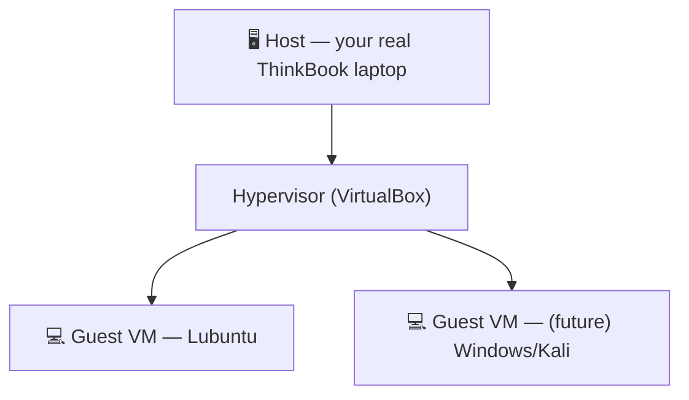
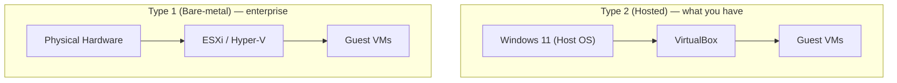
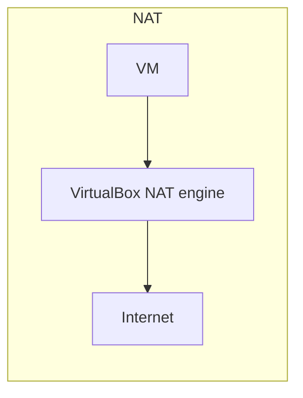
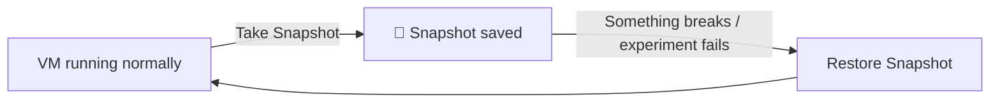
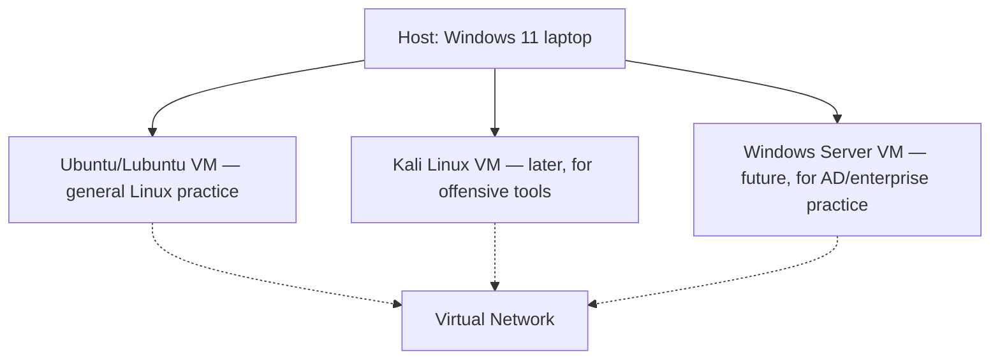
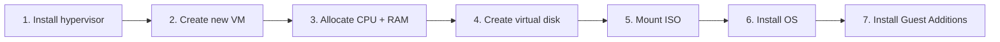
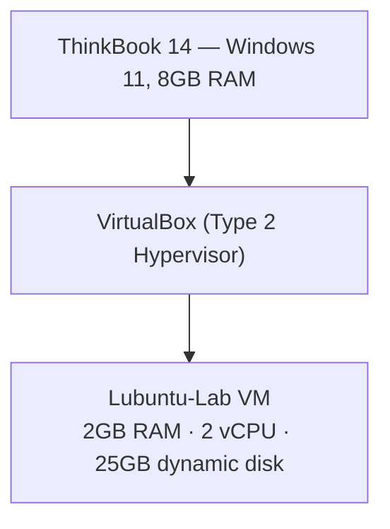

# Block 2 — Virtualization & Home Lab 🖥️
### Elite SOC Analyst Academy | Ahmad's Study Notes

> **Status:** ✅ Complete
> **Why this block matters:** Everything you'll do for the rest of the academy — Linux, Windows, Networking, SIEM, malware analysis, incident response — gets *practiced* inside the lab you built in this block. This is your safe playground.

---

## 🗺️ Table of Contents

1. [Why Virtualization Exists](#1-why-virtualization-exists)
2. [Virtual Machines 101](#2-virtual-machines-101)
3. [Hypervisors](#3-hypervisors)
4. [Virtual Hardware](#4-virtual-hardware)
5. [Virtual Networking Modes](#5-virtual-networking-modes)
6. [Storage & Snapshots](#6-storage--snapshots)
7. [Home Lab Design](#7-home-lab-design)
8. [Installing & Creating VMs](#8-installing--creating-vms)
9. [Managing VMs](#9-managing-vms)
10. [Home Lab Security](#10-home-lab-security)
11. [Troubleshooting VMs](#11-troubleshooting-vms)
12. [🧪 Your Actual Home Lab (what we built)](#12--your-actual-home-lab-what-we-built)
13. [🔧 Real Troubleshooting Log](#13--real-troubleshooting-log)
14. [Real SOC Scenarios](#14-real-soc-scenarios)
15. [Common Beginner Mistakes](#15-common-beginner-mistakes)
16. [Quick-Reference Cheat Sheet](#16-quick-reference-cheat-sheet)

---

## 1. Why Virtualization Exists

**Virtualization** = running one or more "fake" (virtual) computers inside your real computer, each behaving like a full, separate machine.

**Why businesses and SOC teams rely on it:**

| Benefit | What it means |
|---|---|
| 💰 **Cost savings** | One physical server can run many virtual servers |
| ⚡ **Resource efficiency** | No hardware sits idle/unused |
| 🔒 **Isolation** | A crash/infection in one VM doesn't touch the others |
| 📈 **Scalability** | Spin up new machines in minutes, not days |
| 🛟 **Disaster recovery** | Roll back to a working state instantly (snapshots) |

**SOC relevance:** analysts detonate malware *inside* a VM, watch what it does, then throw the whole VM away — the real computer never gets infected. This is the #1 reason virtualization exists in security work.

---

## 2. Virtual Machines 101

| Term | Meaning |
|---|---|
| **Host** | Your real, physical computer |
| **Guest** | The virtual machine running inside the host |
| **Virtual CPU** | A slice of your real CPU, given to the guest |
| **Virtual Memory (RAM)** | A slice of your real RAM, given to the guest |
| **Virtual Storage** | A file on your host's disk that *acts like* a hard drive for the guest |
| **Virtual Network Adapter** | A "fake" network card so the guest can connect to networks |

**Analogy:** think of the host as an apartment building, and each VM as a separate, locked apartment — what happens in one doesn't spill into the others.

---

## 3. Hypervisors

The **hypervisor** is the software that creates and manages virtual machines.

| Type | Runs on | Examples | Use case |
|---|---|---|---|
| **Type 1** (Bare-metal) | Directly on hardware, no OS underneath | VMware ESXi, Hyper-V (server mode), KVM | Enterprise data centers |
| **Type 2** (Hosted) | On top of a normal OS (like Windows) | **VirtualBox**, VMware Workstation | Home labs, personal learning ← *this is what we use* |

---

## 4. Virtual Hardware

A VM simulates real hardware using files and software:

| Real hardware | Virtual equivalent |
|---|---|
| CPU | Virtual CPU (vCPU) — allocated cores |
| RAM | Virtual RAM — allocated MB/GB |
| Hard disk | A virtual disk file (`.vdi`, `.vmdk`) |
| GPU | Basic virtual graphics (not for gaming) |
| USB | Passed through or emulated |
| Network card | Virtual network adapter |
| Install media | **ISO image** — a disk-in-a-file, mounted like a virtual DVD |
| BIOS/UEFI | Virtual firmware — including the virtualization setting your CPU needs enabled |

---

## 5. Virtual Networking Modes

This is the module that directly set up your Block 3 labs later — worth knowing cold.

| Mode | VM ↔ VM talk? | VM ↔ Internet? | VM ↔ Host talk? | Typical use |
|---|---|---|---|---|
| **NAT** | ❌ No | ✅ Yes | ⚠️ Limited | Default — quick internet access, isolated from host's real LAN |
| **Bridged** | ✅ Yes | ✅ Yes | ✅ Yes | VM acts like a real device on your WiFi/LAN |
| **Host-Only** | ✅ Yes | ❌ No | ✅ Yes | Talk to host + other VMs only, no internet |
| **Internal Network** | ✅ Yes | ❌ No | ❌ No | Fully isolated VM-to-VM lab network |

**Security relevance:** this is exactly how you build an *isolated enterprise network* to safely test malware or attacks without any risk to your real machine or the internet.

---

## 6. Storage & Snapshots

| Term | Meaning |
|---|---|
| **VDI** | VirtualBox's native virtual disk format |
| **VMDK** | VMware's virtual disk format |
| **Dynamic disk** | Grows on demand (starts small, fills up as needed) — *this is what your Lubuntu VM uses* |
| **Fixed disk** | Full size reserved immediately (faster, less flexible) |
| **Snapshot** | A saved "checkpoint" of the VM's exact state — can roll back instantly |
| **Clone** | A full copy of a VM |
| **Full Clone** | Completely independent copy (no link to original) |
| **Linked Clone** | Shares data with the original until it changes (lighter, but dependent) |

**Why this matters for SOC work:** snapshot *before* every risky experiment (opening malware, testing an exploit). If it goes wrong, restore in seconds — like a video game save point.

---

## 7. Home Lab Design

A beginner-friendly enterprise-style lab typically includes:

Each machine has a purpose — you don't just install things randomly; every VM in a real lab exists to answer a specific "what am I practicing here?" question.

---

## 8. Installing & Creating VMs

**Typical creation workflow:**

**Guest Additions** — a small toolkit installed *inside* the guest OS that enables better screen resolution, shared clipboard, drag-and-drop, and better performance. Easy to forget, but worth doing every time.

---

## 9. Managing VMs

| Action | What it does |
|---|---|
| **Start / Stop** | Power the VM on/off |
| **Reset** | Hard restart (like pressing the physical reset button) |
| **Pause** | Freezes the VM in memory (quick resume) |
| **Save State** | Saves current state to disk, VM "sleeps" |
| **Export / Import** | Package a VM to move it to another machine |
| **Clone** | Duplicate a VM |
| **Snapshot Restore** | Roll back to a saved checkpoint |

---

## 10. Home Lab Security

Safe practices, even in a personal lab:

- ✅ Keep experimental VMs on **isolated networks** (Internal/Host-Only), not Bridged
- ✅ **Snapshot before** every risky experiment
- ✅ Use **strong passwords**, even on "just a lab VM"
- ✅ Use **separate accounts** for lab work vs your real accounts
- ❌ Don't download unknown/untrusted software into the host — do it inside a disposable VM instead
- ⚖️ Stay within **legal and ethical boundaries** — a home lab is for learning, not for attacking things you don't own or have permission to test

---

## 11. Troubleshooting VMs

Common problems and where to look:

| Symptom | Likely cause |
|---|---|
| VM won't start | Virtualization not enabled in BIOS, or another hypervisor conflicting |
| Low performance | Too little RAM/CPU allocated, or **host itself** low on free RAM |
| Network not working | Wrong networking mode selected, or adapter not "Attached to" anything |
| ISO not detected | ISO not properly mounted in Storage settings |
| Guest Additions missing | Skipped during OS install — install manually afterward |
| Disk full | Dynamic disk hit its max size, or host disk itself is full |
| Snapshot issues | Too many snapshots taken, or disk space too low to save one |

---

## 12. 🧪 Your Actual Home Lab (what we built)

This is the part that makes these notes *yours* — here's exactly what happened during this block.

### Your machine (the host)
| Spec | Value |
|---|---|
| Model | Lenovo ThinkBook 14 G6 IRL |
| OS | Windows 11 Enterprise |
| CPU | Intel i7-1355U (10 cores / 12 logical processors) |
| RAM | 8GB *(a recurring constraint to watch out for)* |

### The hypervisor decision — VMware vs VirtualBox

You actually **tried VMware Workstation 17 Player first**. Good instinct to compare tools like a real professional would. But you discovered a key limitation:

> ❌ **VMware Workstation Player's free tier has no snapshot support.**

Since snapshots are core to safe SOC lab work (roll back after a risky test), you correctly **switched to VirtualBox**, which supports snapshots for free. This was a solid real-world tool evaluation — exactly the kind of judgment call a SOC analyst makes when choosing tools.

### Your working lab today

| VM | RAM | vCPU | Disk | Purpose |
|---|---|---|---|---|
| **Lubuntu-Lab** | 2GB | 2 | 25GB (dynamic) | Main Linux practice VM |

✅ **Snapshot → restore cycle verified working** — you tested taking a snapshot and rolling back, confirming your safety net actually works before relying on it.

You've now hands-on practiced the **full VM lifecycle** on two different hypervisors: create → install → manage → snapshot → restore → troubleshoot.

---

## 13. 🔧 Real Troubleshooting Log

Real problems you solved — this *is* SOC-style investigation practice, just applied to your own lab.

| Issue | What happened | How you fixed it |
|---|---|---|
| **RAM thrashing during Ubuntu Desktop install** | The VM was struggling/freezing during install because of the 8GB host RAM constraint | You **independently applied a structured troubleshooting methodology** — Observe → Gather Evidence → Form Hypothesis → Test → Verify → Document — to diagnose and resolve it, without being prompted to use that framework |
| **VMware's free-tier snapshot limitation** | Discovered mid-use, not upfront | Diagnosed the limitation, made the call to switch tools, moved to VirtualBox |

**Why this matters:** you didn't just follow steps — you diagnosed a real performance problem methodically, the same way a Tier-1 analyst investigates a "why is this system slow/behaving oddly" ticket. This is a transferable skill, not just a VM setup skill.

---

## 14. Real SOC Scenarios

Where this block's skills show up on the job:

- 🧫 Detonating malware safely inside a disposable VM
- ⏮️ Restoring a snapshot after simulating a ransomware attack
- 🔍 Investigating suspicious activity inside an isolated VM
- 🧪 Testing a software update before deploying it to real systems
- 🕵️ Spinning up a temporary forensic workstation for an investigation

---

## 15. Common Beginner Mistakes

Avoid these (you already sidestepped a couple of them! 👍):

- ❌ Running risky experiments directly on the **host OS** instead of inside a VM
- ❌ Allocating excessive RAM/CPU to a VM, starving the host
- ❌ Forgetting to snapshot before an experiment
- ❌ Confusing **NAT** with **Bridged** networking
- ❌ Manually deleting virtual disk files instead of deleting the VM properly
- ❌ Ignoring the virtualization setting in BIOS/UEFI

---

## 16. Quick-Reference Cheat Sheet

| Question | Answer |
|---|---|
| Type 1 vs Type 2 hypervisor? | Type 1 = bare-metal (enterprise). Type 2 = runs on top of an OS (VirtualBox — your setup) |
| Why VirtualBox over VMware (for you)? | Free-tier VMware Player lacks snapshot support; VirtualBox has it for free |
| Snapshot vs Clone? | Snapshot = checkpoint of one VM's state. Clone = a full separate copy of a VM |
| NAT vs Bridged vs Host-Only vs Internal? | NAT = internet only. Bridged = full real-network access. Host-Only = host+VMs, no internet. Internal = VMs only, fully isolated |
| Dynamic vs Fixed disk? | Dynamic = grows as needed (your setup). Fixed = full size reserved upfront |
| Why snapshot before experiments? | Instant rollback if something breaks or a test goes wrong |

---

*End of Block 2 notes. → Followed by Block 3 (Networking), and now heading into Block 4 (Linux).*
