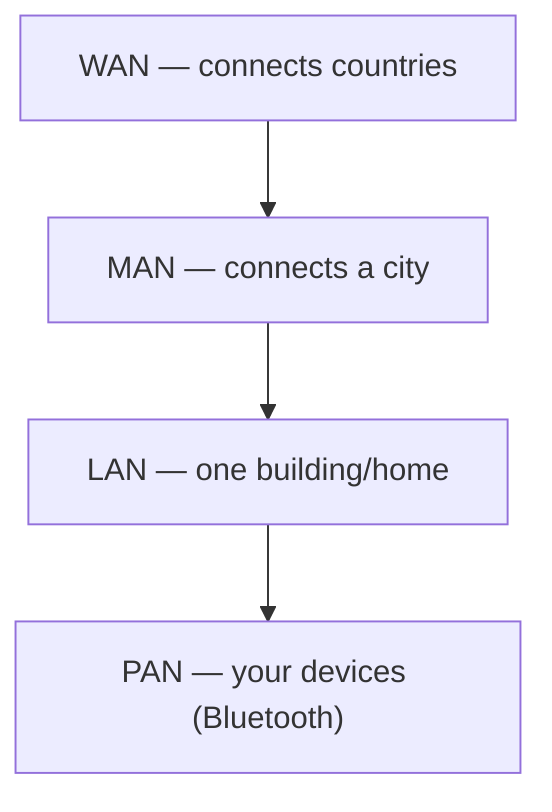
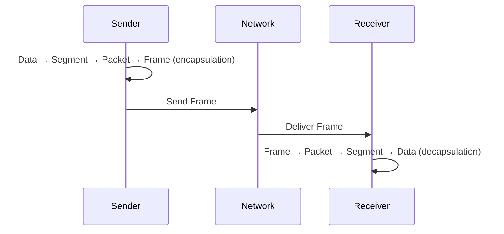
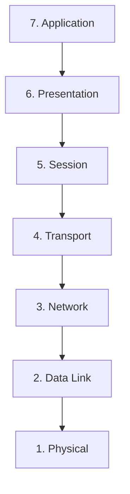
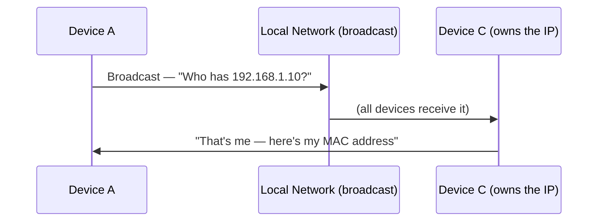
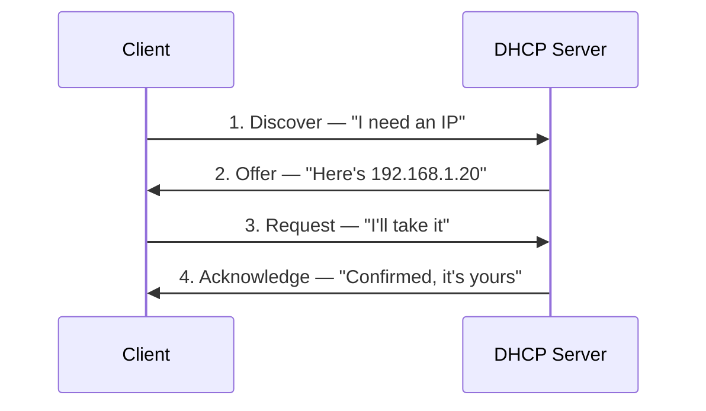
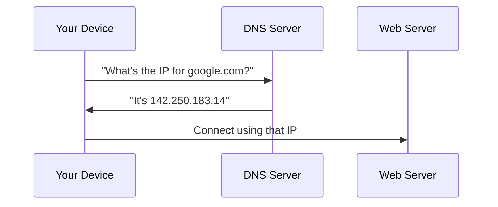
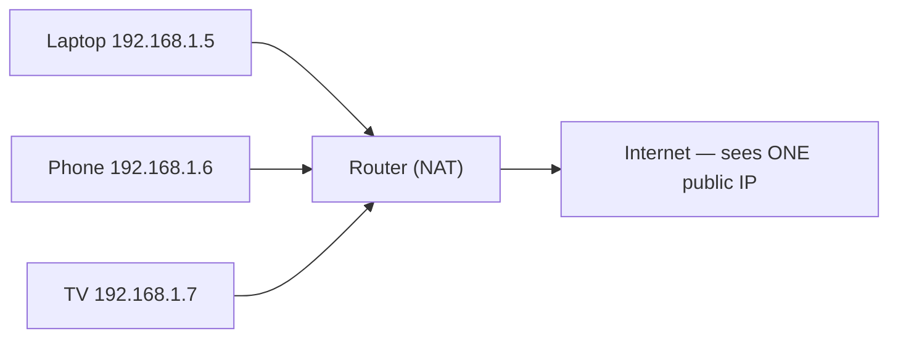
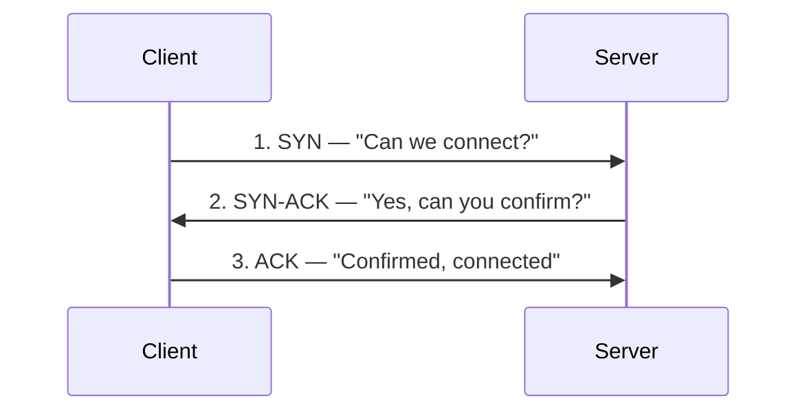
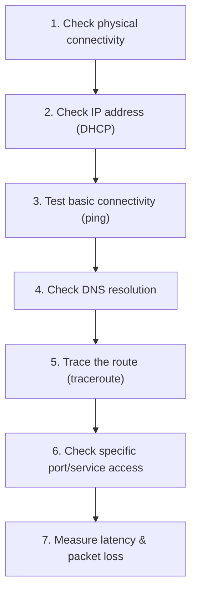
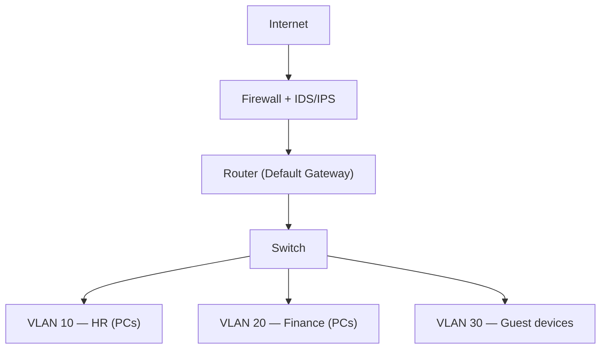

# Block 3 — Networking Fundamentals
### Elite SOC Analyst Academy | Ahmad's Study Notes

> **Status:** ✅ Complete — 20 theory modules, 5 hands-on labs, 1 mini project
> **Goal of this block:** Build the networking foundation every SOC Analyst needs, since almost every security alert, log, and investigation involves network traffic.

---

## Table of Contents

1. [Networking Basics](#1-networking-basics)
2. [Data Travel & Encapsulation](#2-data-travel--encapsulation)
3. [OSI Model](#3-osi-model)
4. [TCP/IP Model](#4-tcpip-model)
5. [IP Addressing (IPv4 & IPv6)](#5-ip-addressing)
6. [MAC Addresses & ARP](#6-mac-addresses--arp)
7. [DHCP](#7-dhcp)
8. [DNS](#8-dns)
9. [Routing & Switching](#9-routing--switching)
10. [NAT](#10-nat)
11. [Common Protocols & Ports](#11-common-protocols--ports)
12. [TCP vs UDP](#12-tcp-vs-udp)
13. [Firewalls](#13-firewalls)
14. [VPNs](#14-vpns)
15. [Proxies & Load Balancers](#15-proxies--load-balancers)
16. [Wireshark & Packet Analysis](#16-wireshark--packet-analysis)
17. [Network Troubleshooting](#17-network-troubleshooting)
18. [Network Security Concepts](#18-network-security-concepts)
19. [Hands-On Labs Summary](#19-hands-on-labs-summary)
20. [Troubleshooting Log (real issues solved)](#20-troubleshooting-log)
21. [Mini Project — Enterprise Network Map](#21-mini-project--enterprise-network-map)
22. [Quick-Reference Cheat Sheet](#22-quick-reference-cheat-sheet)

---

## 1. Networking Basics

A **network** is two or more devices connected to share data and resources.

| Type | Range | Example |
|---|---|---|
| **PAN** (Personal) | A few meters | Bluetooth earbuds ↔ phone |
| **LAN** (Local) | One building/home | Home WiFi |
| **MAN** (Metropolitan) | One city | City ISP network |
| **WAN** (Wide) | Countries/world | The Internet |

- **Internet** = public, open to everyone.
- **Intranet** = private, internal-only network.
- **Client-Server model**: one machine (server) provides a resource, another (client) requests it — e.g. browser (client) ↔ Google (server). Malware "phoning home" uses this same model.
- **Peer-to-Peer (P2P)**: no fixed server, devices talk directly (e.g. torrents).

---

## 2. Data Travel & Encapsulation

Data is broken into small pieces and wrapped in layers before it travels.

| Term | Meaning |
|---|---|
| **Packet** | A chunk of data traveling across a network |
| **Frame** | Packet + local-network wrapping (Ethernet/WiFi) |
| **Segment** | Transport-layer (TCP/UDP) data unit |
| **Encapsulation** | Wrapping data in layer after layer, each adding a header |
| **Decapsulation** | Unwrapping those layers at the destination |

**SOC angle:** attacks can happen at any layer — sniffing (data), spoofing (packet), or local interception (frame).

---

## 3. OSI Model

7 conceptual layers describing how data moves between two machines.

**Mnemonic:** *Please Do Not Throw Sausage Pizza Away*

| # | Layer | Job | Example |
|---|---|---|---|
| 7 | Application | User-facing apps | Browser, WhatsApp |
| 6 | Presentation | Format/encrypt/translate | SSL/TLS, encoding |
| 5 | Session | Start/end connections | Login sessions |
| 4 | Transport | Reliable delivery | TCP, UDP |
| 3 | Network | Routing | IP addresses |
| 2 | Data Link | Local delivery | MAC addresses |
| 1 | Physical | Raw bits, cables, signals | Ethernet cable, WiFi |

Troubleshooting is done **bottom-up**: cable → local network → IP → connection → app.

---

## 4. TCP/IP Model

The simplified, 4-layer model actually used in the real world.

| OSI (7 layers) | TCP/IP (4 layers) |
|---|---|
| Application, Presentation, Session | **Application** |
| Transport | **Transport** |
| Network | **Internet** |
| Data Link, Physical | **Network Access** |

Real tools (Wireshark, firewalls) use TCP/IP terminology; interviews often use OSI terminology. Know both.

---

## 5. IP Addressing

### IPv4
- Format: 4 numbers (0–255), dot-separated — e.g. `192.168.1.5`
- **Public IP** — unique, internet-reachable
- **Private IP** — local-only (`192.168.x.x`, `10.x.x.x`), not directly internet-reachable
- **Static** — fixed | **Dynamic** — changes (via DHCP)
- **Subnet mask** (e.g. `255.255.255.0`) splits the address into *network* portion and *host* portion

### IPv6
- Created because IPv4 (~4.3 billion addresses) ran out
- 128-bit, hexadecimal, colon-separated — e.g. `2001:4860:4860::8888`
- Practically unlimited address space
- Most networks today are **dual-stack** (both IPv4 and IPv6 active)

---

## 6. MAC Addresses & ARP

| | MAC Address | IP Address |
|---|---|---|
| What | Permanent hardware address | Logical, network address |
| Layer | Data Link | Network |
| Changes? | No | Yes (can be dynamic) |
| Example | `00:1A:2B:3C:4D:5E` | `192.168.1.5` |

**Analogy:** MAC = your CNIC (permanent ID). IP = your current home address (can change).

**ARP (Address Resolution Protocol)** translates IP → MAC on a local network.

**ARP Spoofing/Poisoning:** since ARP has no authentication, an attacker can fake a reply and claim to be the target device — enabling a **Man-in-the-Middle (MITM)** attack.

---

## 7. DHCP

Automatically assigns IP addresses so devices don't need manual configuration.

**DORA process:**

IPs from DHCP are **leased** (temporary), not permanent — this is why home/office IPs are usually dynamic.

**Security risk — Rogue DHCP Server:** a fake DHCP server can hand out malicious settings (e.g. bad DNS), enabling MITM attacks.

---

## 8. DNS

The "phonebook of the internet" — translates domain names into IP addresses.

**Security risks:**
- **DNS Spoofing/Poisoning** — fake DNS records redirect victims to malicious sites
- **DNS Tunneling** — attackers hide stolen data inside DNS traffic (often allowed through firewalls)
- **Malicious domains** — SOC analysts watch DNS logs for connections to known bad domains

---

## 9. Routing & Switching

| Device | Connects | Uses | Analogy |
|---|---|---|---|
| **Switch** | Devices *within* one LAN | MAC address | Rooms inside one building |
| **Router** | Two or more *different* networks | IP address | Road between buildings |
| **Default Gateway** | The exit point out of the local network (usually the router) | — | The building's front door |

**Routing table** — the router's "map" for deciding the best path for each packet.

- **Broadcast domain** — devices reached by a broadcast message
- **Collision domain** — devices at risk of data "colliding" if they transmit at once (mostly solved by modern switches)

---

## 10. NAT (Network Address Translation)

Solves two problems: limited IPv4 addresses, and hides private IPs from the internet.

- **PAT (Port Address Translation)** — the common home-router version; uses port numbers to track which internal device owns which response.
- SOC relevance: a public IP behind NAT can represent *many* internal devices — need NAT/firewall logs to identify the exact culprit machine.

---

## 11. Common Protocols & Ports

| Protocol | Full Form | Job | Port |
|---|---|---|---|
| HTTP | HyperText Transfer Protocol | Web (unencrypted) | 80 |
| HTTPS | HTTP Secure | Web (encrypted) | 443 |
| FTP | File Transfer Protocol | File transfer | 21 |
| SSH | Secure Shell | Secure remote access | 22 |
| Telnet | — | Remote access (insecure, old) | 23 |
| SMTP | Simple Mail Transfer Protocol | Sending email | 25 |
| DNS | Domain Name System | Name → IP | 53 |
| DHCP | — | Auto IP assignment | 67/68 |

**Red flags for a SOC analyst:** Telnet usage (insecure), sensitive data over HTTP (unencrypted), or traffic on unusual ports (e.g. 4444, common in malware).

---

## 12. TCP vs UDP

| | TCP | UDP |
|---|---|---|
| Reliability | Reliable (guarantees delivery) | Unreliable (no guarantee) |
| Handshake | Yes (3-way) | No |
| Speed | Slower | Faster |
| Used for | Web, email, file transfer | Streaming, gaming, calls |
| Analogy | Registered courier | Normal letter |

**3-Way Handshake:**

**SYN Flood attack:** attacker sends thousands of SYNs, never completes the ACK — server resources get exhausted (a type of Denial of Service). **Port scanning** uses TCP/UDP to check which ports are open on a target.

---

## 13. Firewalls

A guard between your network and the outside world, allowing/blocking traffic based on rules.

| Type | How it works |
|---|---|
| **Packet Filtering** | Checks each packet individually (IP, port) — no memory of past packets |
| **Stateful** | Remembers connection state — allows replies to requests you made |
| **NGFW** (Next-Gen) | Deep packet inspection — detects malware, identifies apps, advanced threat detection |

SOC relevance: firewall logs show blocked traffic, repeated attack attempts, and misconfigurations.

---

## 14. VPNs

Creates an encrypted "tunnel" through the public internet.

| Type | Use case |
|---|---|
| **Remote Access VPN** | One device (e.g. laptop) → company network |
| **Site-to-Site VPN** | Two offices/networks connected securely |

- Encryption scrambles data so interceptors only see cipher text.
- SOC relevance: monitor VPN logins for unusual times/locations; attackers also use VPNs to hide their real location; **split tunneling** (misconfigured VPN) can leak unprotected traffic.

---

## 15. Proxies & Load Balancers

| | Sits on... | Purpose |
|---|---|---|
| **Forward Proxy** | Client side | Filters/monitors employee internet use |
| **Reverse Proxy** | Server side | Hides real server IP, manages incoming traffic |
| **Load Balancer** | Server side | Spreads traffic across multiple servers, helps resist DDoS |

---

## 16. Wireshark & Packet Analysis

Wireshark captures and displays live network traffic, packet by packet.

**Core skills:** interface selection → packet capture → filtering (`dns`, `http`, `tcp.flags.syn==1`) → following conversations → reading headers → exporting `.pcap` files.

**What to interpret in captured traffic:**
- **DNS requests** — suspicious/unusual domains
- **HTTP requests** — plaintext data visible (risk!)
- **TLS handshake** — encryption negotiation; the **SNI field** (domain name) is visible even before encryption starts
- **ICMP traffic** — pings; a flood of ICMP can indicate a DoS attack
- **TCP sessions** — full 3-way handshake visible
- **Connection resets (RST)** — repeated resets can indicate a block or an issue

---

## 17. Network Troubleshooting

Structured, **bottom-up** approach (matches the OSI model):

SOC relevance: sometimes a "connectivity problem" is actually a firewall correctly blocking malicious traffic — troubleshooting skill helps tell the difference.

---

## 18. Network Security Concepts

| Concept | Meaning |
|---|---|
| **Segmentation** | Splitting a network into smaller pieces so an incident stays contained |
| **VLAN** | Logical segmentation on the same physical switch (e.g. HR, Finance, Guest) |
| **IDS** | Detects & alerts only (a security camera) |
| **IPS** | Detects **and blocks** in real time (a security guard) |
| **Zero Trust** | "Never trust, always verify" — even internal traffic is checked |
| **North-South traffic** | Traffic going in/out of the network (to/from the internet) |
| **East-West traffic** | Traffic between internal devices/servers |

Modern security monitors both North-South *and* East-West traffic, since attackers who get inside can move laterally (East-West) between systems.

---

## 19. Hands-On Labs Summary

| Lab | What was done | Key result |
|---|---|---|
| **Lab 1** | `ipconfig /all` (Windows) + `ip addr`/`ip route` (Lubuntu VM) | Found real IP, subnet, gateway, DNS on both host and VM; discovered VM uses VirtualBox **NAT mode** (`10.0.2.x`), separate from host's real WiFi network (`192.168.1.x`) |
| **Lab 2** | `ping`, `tracert`/`traceroute`, `nslookup` on both machines | VM traceroute was blocked by VirtualBox's NAT (couldn't forward ICMP TTL-exceeded replies); Windows host traceroute succeeded, showing the real hop-by-hop path to Google's servers across Pakistani ISP infrastructure |
| **Lab 3** | Installed & used Wireshark on the VM | Captured a live DNS query and inspected Ethernet/IPv4/DNS encapsulation layers; saw Google return 5 load-balanced IPs for one domain |
| **Lab 4** | Cloned a second VM, set both to VirtualBox "Internal Network" mode, assigned static IPs, pinged between them | 0% packet loss, ~1–2ms latency between two isolated VMs on the same physical machine — proved VM-to-VM communication and showed how physical distance affects latency |
| **Lab 5** | Analyzed the Lab 3 capture for source/destination IP, protocol, port, and packet sequence | Identified a full TCP 3-way handshake on port 443 (HTTPS); "Follow TCP Stream" showed encrypted cipher text except for the readable **SNI** field (`www.googletagmanager.com`) sent before encryption began |

---

## 20. Troubleshooting Log

Real problems solved during this block — good SOC-style practice in themselves.

| Issue | Cause | Fix |
|---|---|---|
| Leftover VMware adapters/services after switching to VirtualBox | VMware doesn't fully uninstall via Control Panel alone | Removed adapters via Device Manager, disabled leftover services, cleaned residual folders/registry entries |
| Wireshark: *"You don't have permission to capture on local interfaces"* | User account not yet part of the `wireshark` group (or group change not yet active in the session) | Added user to the `wireshark` group during install (`<Yes>` prompt), then restarted the VM to apply the new group membership |
| `traceroute` inside the VM showed only 1 hop, then all `* * *` | VirtualBox's NAT engine doesn't forward ICMP "TTL Exceeded" replies needed for traceroute to work past the first hop | Understood as a NAT limitation — confirmed by running the same test on the Windows host (real network), where traceroute completed normally |
| Manual `ip addr add ...` kept getting reset, `ping: connect: Network is unreachable` | **NetworkManager** actively manages the interface and overrides manual IP changes | Used `nmcli connection add ... ip4 <address>` to create a proper, persistent NetworkManager-managed connection profile instead of a raw manual command |

**Lesson learned:** quick manual commands (`ip addr add`) are temporary and get overridden by system services; proper configuration tools (`nmcli`, netplan) are what real IT/SOC environments actually rely on.

---

## 21. Mini Project — Enterprise Network Map

**Key reasoning points (self-explained during the project):**
- Traffic passes through the **firewall first** so malicious traffic gets filtered/blocked before ever reaching internal systems (IDS/IPS adds detection + active blocking).
- The **router** connects the internal network to the outside world and manages IP-based addressing.
- The **switch** connects internal devices using MAC addresses.
- **VLAN segmentation** exists for **containment** — if one segment (e.g. Guest) is compromised, the incident stays isolated there instead of spreading laterally (East-West) into HR/Finance.
- If an infected machine appears in the Guest VLAN, HR and Finance remain unaffected *because of* that segmentation — and a SOC analyst would investigate the source and scope of the infection before declaring it resolved.

---

## 22. Quick-Reference Cheat Sheet

| Question | Answer |
|---|---|
| MAC vs IP? | MAC = permanent hardware ID (Data Link). IP = logical, changeable address (Network) |
| TCP vs UDP? | TCP = reliable + handshake. UDP = fast, no guarantee |
| IDS vs IPS? | IDS = detects & alerts only. IPS = detects & blocks |
| Public vs Private IP? | Public = internet-reachable. Private = local-network only |
| Forward vs Reverse Proxy? | Forward = client-side. Reverse = server-side |
| North-South vs East-West? | N-S = in/out of network. E-W = between internal devices |
| Why NAT? | Saves IPv4 addresses + hides private IPs from the internet |
| Why segmentation/VLANs? | Contains an incident to one part of the network |

---

*End of Block 3 notes. Next: Block 4 — Linux.*
